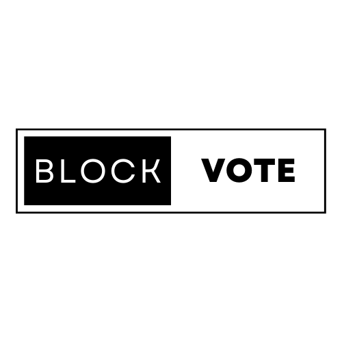

<!-- Improved compatibility of back to top link: See: https://github.com/othneildrew/Best-README-Template/pull/73 -->
<a name="readme-top"></a>
<!--
*** Thanks for checking out the Best-README-Template. If you have a suggestion
*** that would make this better, please fork the repo and create a pull request
*** or simply open an issue with the tag "enhancement".
*** Don't forget to give the project a star!
*** Thanks again! Now go create something AMAZING! :D
-->


<!-- PROJECT SHIELDS -->
<!--
*** I'm using markdown "reference style" links for readability.
*** Reference links are enclosed in brackets [ ] instead of parentheses ( ).
*** See the bottom of this document for the declaration of the reference variables
*** for contributors-url, forks-url, etc. This is an optional, concise syntax you may use.
*** https://www.markdownguide.org/basic-syntax/#reference-style-links
-->
<!-- [![Contributors][contributors-shield]][contributors-url]
[![Forks][forks-shield]][forks-url]
[![Stargazers][stars-shield]][stars-url]
[![Issues][issues-shield]][issues-url]
[![MIT License][license-shield]][license-url]
[![LinkedIn][linkedin-shield]][linkedin-url] -->


<!-- PROJECT LOGO -->
<br />
<div align="center">
  <a href="https://github.com/apostolescus/BlockVote">
    
  </a>

  <h3 align="center">Block Vote</h3>

  <p align="center">
    Proof of concept implementation for a secure voting system on Ethereum Blockchain
using Paillier homomorphic encryption
    <br />
    <!-- <a href="https://github.com/othneildrew/Best-README-Template"><strong>Explore the docs »</strong></a>
    <br />
    <br />
    <a href="https://github.com/othneildrew/Best-README-Template">View Demo</a>
    ·
    <a href="https://github.com/othneildrew/Best-README-Template/issues">Report Bug</a>
    ·
    <a href="https://github.com/othneildrew/Best-README-Template/issues">Request Feature</a> -->
  </p>
</div>


<!-- TABLE OF CONTENTS -->
<details>
  <summary>Table of Contents</summary>
  <ol>
    <li>
      <a href="#about-the-project">About The Project</a>
      <ul>
        <li><a href="#built-with">Built With</a></li>
         <li><a href="#built-with">Architecture</a></li>
      </ul>
    </li>
    <li>
      <a href="#getting-started">Getting Started</a>
      <ul>
        <li><a href="#prerequisites">Prerequisites</a></li>
        <li><a href="#installation">Installation</a></li>
      </ul>
    </li>
    <li><a href="#roadmap">Roadmap</a></li>
    <li><a href="#license">License</a></li>
    <li><a href="#contact">Contact</a></li>
    <li><a href="#acknowledgments">Acknowledgments</a></li>
  </ol>
</details>


<!-- ABOUT THE PROJECT -->
## About The Project

<!-- [![Product Name Screen Shot][product-screenshot]](https://example.com) -->

! This project is a proof of concept and the smart contract is not designed to be gas optimised !

This project aims to implement a secure voting system that ensures transparency, anonymity, integrity and confidentiality. In order to achieve this, the project was developed to run on a blockchain in a decentralized environment. This allows for the vote session to be held in a transparent manner, eliminating any fraud possibility, given the fact that anyone can verify the transactions on the blockchain. The main problem that arises from this is that, given its public character, all casted votes can easily be seen by everybody and can be traced to one wallet. In order to solve this challenge, all the votes are encrypted using a homomorphic encryption algorithm that allows to calculate the sum of the encrypted numbers.In this way, the votes can be casted, stored and the results fetched from the blockchain in a completely anonymous way.

<p align="right">(<a href="#readme-top">back to top</a>)</p>


### Built With


[](https://skills.thijs.gg)


<p align="right">(<a href="#readme-top">back to top</a>)</p>

### Architecture

The project is composed from three main parts:
1. Smart Contract
2. Encryption server
3. Web server

[![Product Name Screen Shot][product-screenshot]]()

<!-- GETTING STARTED -->
## Getting Started

To get a local copy up and running follow these simple example steps.

### Prerequisites

* Nodejs
    - Check install: 
    
        ``` node --version ```
        (>= v16)
* Yarn 
    - Check install:

        ``` yarn --version ```
* brownie
    ``` 
    python3 -m pip install --user pipx
    python3 -m pipx ensurepath
    pipx install eth-brownie
    ```

* ganache 

    https://github.com/trufflesuite/ganache


### Run 

_After all the prerequisites have been installed follow the next steps to have the project up and running_

1. Start ganache 
2. Run deploy script on local ganache
   ```sh
   brownie run ./scripts/deploy.py --network ganache-local
   ```

You should now see in the terminal all the transactions done in the test script.

<p align="right">(<a href="#readme-top">back to top</a>)</p>


<!-- USAGE EXAMPLES
## Usage

Use this space to show useful examples of how a project can be used. Additional screenshots, code examples and demos work well in this space. You may also link to more resources.

_For more examples, please refer to the [Documentation](https://example.com)_

<p align="right">(<a href="#readme-top">back to top</a>)</p> -->


<!-- ROADMAP -->
## Roadmap

- [x] Create smart contract
- [x] Test smart contract locally
- [x] Deploy SC on goerli
- [ ] Create basic web3 interface
- [ ] Integration test 
- [ ] Encrypt key storage
- [ ] Improve UI aesthetic 


<p align="right">(<a href="#readme-top">back to top</a>)</p>


<!-- LICENSE -->
## License

Distributed under the MIT License. See `LICENSE.txt` for more information.

<p align="right">(<a href="#readme-top">back to top</a>)</p>


<!-- CONTACT -->
## Contact

Apostolescu Stefan - [email](https://twitter.com/your_username) - apostolescus@outlook.com

Project Link: [https://github.com/apostolescus/BlockVote](https://github.com/apostolescus/BlockVote)

<p align="right">(<a href="#readme-top">back to top</a>)</p>


<!-- ACKNOWLEDGMENTS -->
## Acknowledgments

Resources used

* [Solidity, Blockchain and Smart Contract Course - Python](https://www.youtube.com/watch?v=M576WGiDBdQ&t=17002s)
* [Learn Blockchain, Solidity and Full Stack Web3 -JS](https://www.youtube.com/watch?v=gyMwXuJrbJQ&t=49264s)

<p align="right">(<a href="#readme-top">back to top</a>)</p>

[linkedin-url]: https://linkedin.com/in/othneildrew
[product-screenshot]: images/Vote_encryption.png
